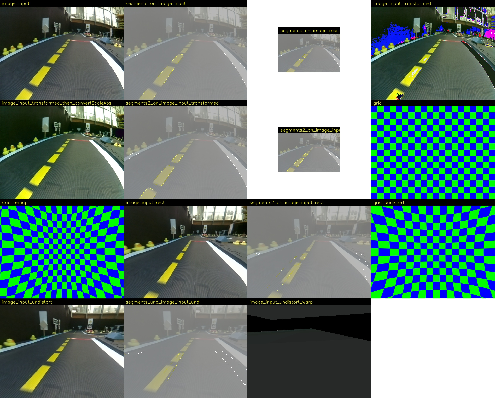

# Package `complete_image_pipeline` {#complete_image_pipeline}

<move-here src="#complete_image_pipeline-autogenerated"/>

## Program `single_image_pipeline`

This runs the entire pipeline:

    $ rosrun complete_image_pipeline single_image_pipeline --image ![image] --line_detector ![detector] --image_pre ![image_prep]

where `![image]` can be a filename or a URL.

For example, this:

    $ rosrun complete_image_pipeline single_image_pipeline --image "https://www.dropbox.com/s/r1bpyb8fd5577dm/frame0002.jpg?dl=1"

results in an output as in .

    <figcaption>Output of <code>single_image_pipeline</code></figcaption>
    

